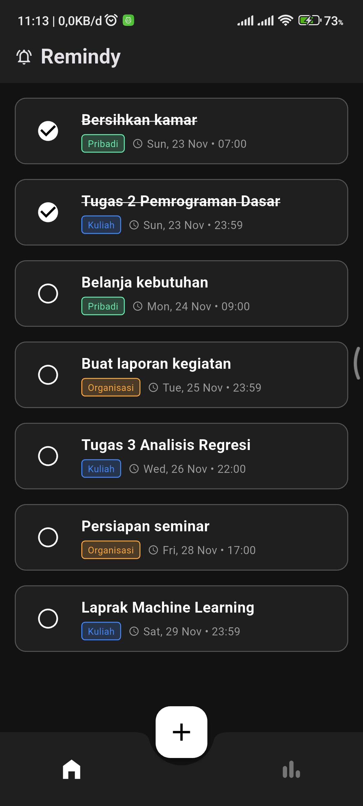
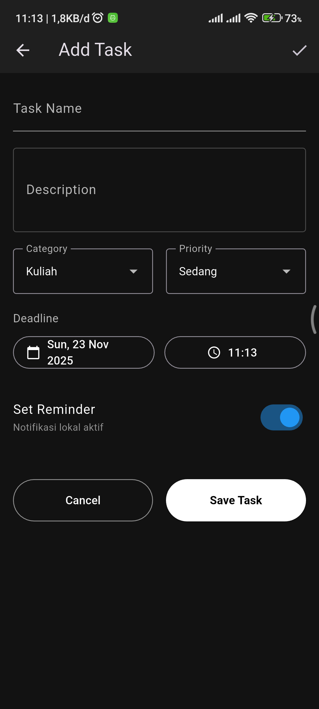
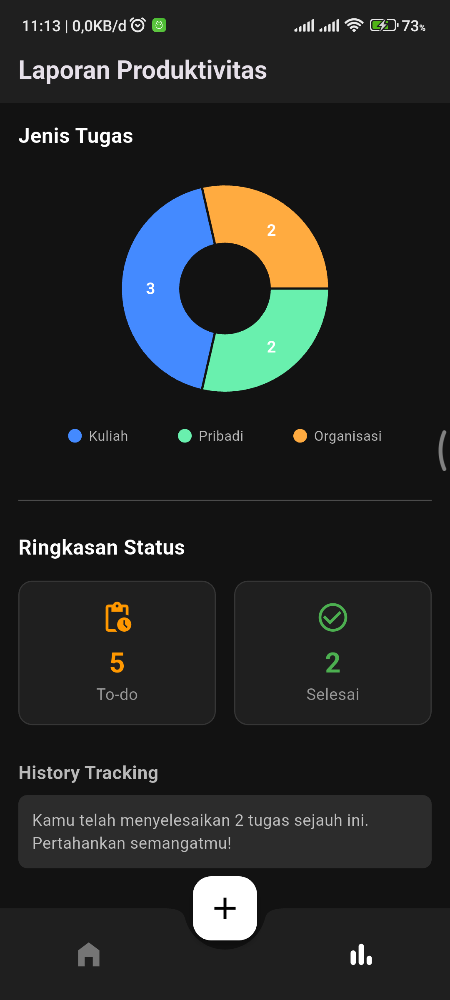

# Remindy

Remindy adalah aplikasi manajemen tugas (Task Management) berbasis mobile yang dirancang untuk membantu pelajar dan mahasiswa mengelola tenggat waktu akademik dengan arsitektur Offline-First.

## Screenshots
| Home | Add Task | Stats |
| ---- | -------- | ----- |
||||

## Fitur Utama
1. Manajemen Tugas (CRUD): Tambah, Edit, Hapus (Swipe-to-delete), dan Tandai Selesai.
2. Smart Notifications: Pengingat otomatis saat Deadline, H-1 Jam, dan H-1 Hari.
3. Offline-First: Menggunakan SQLite, data tersimpan aman tanpa koneksi internet.
4. Productivity Stats: Grafik Pie Chart untuk memantau proporsi tugas.

## Tech Stack
- Framework: Flutter
- Language: Dart
- Architecture: MVVM (Model-View-ViewModel)
- Local Database: SQFlite
- Notifications: Flutter Local Notifications
- Charts: FL Chart

## Getting Started

1. Clone repositori: `git clone https://github.com/alfathrozaqi/remindy.git`
2. Install dependencies: `flutter pub get`
3. Jalankan aplikasi: `flutter run`

## Credits

Dikembangkan oleh IMKA Dev untuk memenuhi tugas mata kuliah Rekayasa Perangkat Lunak.
- [@izzanbcy](https://github.com/izzanbcy) (Project Manager)
- [@BamzzzK](https://github.com/bamzzzk) (System Analyst)
- [@keyie2906-cmd](https://github.com/keyie2906-cmd) (System Designer)
- [@alfathrozaqi](https://github.com/alfathrozaqi) (System Programmer)
